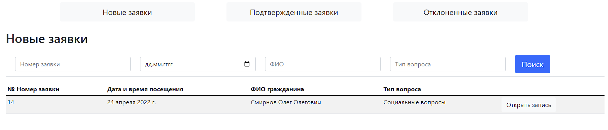
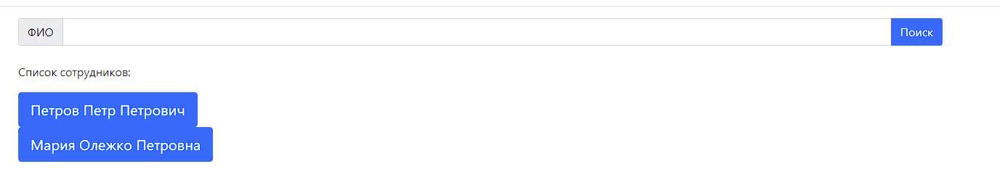
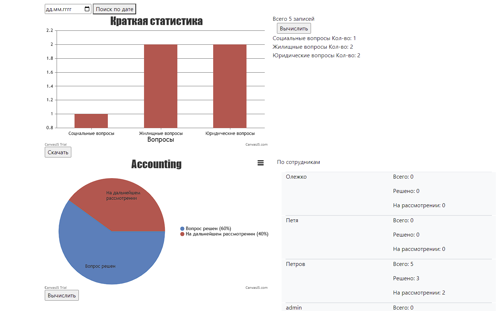
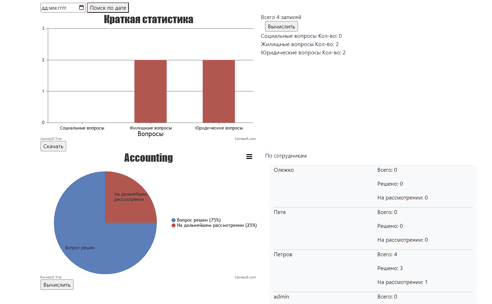

# Сайт - система управления записями на прием
___
# Роли
1. Роль Админа
   1. Просматривать заявки (Все)
   2. Устанавливать сотрудников на заявку 
   3. Устанавливать решение по заявке
   4. Просматривать и составлять расписание 
   5. Устанавливать для сотрудника категории вопросов, с которыми он может работать 
   6. У админа есть доступ в админ панель, через которую он может изменять пароли для пользователей

2. Роль сотрудника
   1. Просматривать заявки (Все)
   2. Устанавливать сотрудников на заявку 
   3. Устанавливать решение по заявке
   4. Просматривать и составлять расписание 
   5. Формировать расписание для отдельного сотрудника и скачивать сформированный список
   6. Составлять отчет и анализ по решению вопросов (2 диаграммы + 2 таблицы), сохранять в PDF

3. Роль Секретарь
   1. Имеет доступ только к подтвержденным заявкам
   2. Формировать список подтвержденных заявок, скачивать в виде csv
   3. Устанавливать сотрудников на заявку 
   4. Устанавливать решение по заявке
___
# Функции
___
1. Поиск по заявкам по 4 критериям (Номер заявки, дата подачи заявки, ФИО, Тип вопроса)
  + 
  + При неудаче выдается сообщение
  + 
  + В зависимости от того где вы находитесь изменяться результат поиска, то есть новые заявки, подтвержденные и тд.
  + 
```
  
```
2. Поиск по сотрудникам 
   + 
   + Ниже выведены все сотрудники, через которых можно сразу перейти на вкладку выбора для них категорий вопросов
3. Проводить анализ решенных и нерешенных заявок 
   + Если дата не указана, проводиться анализ за весь период
   + 
   + 
   + Два графика можно скачать